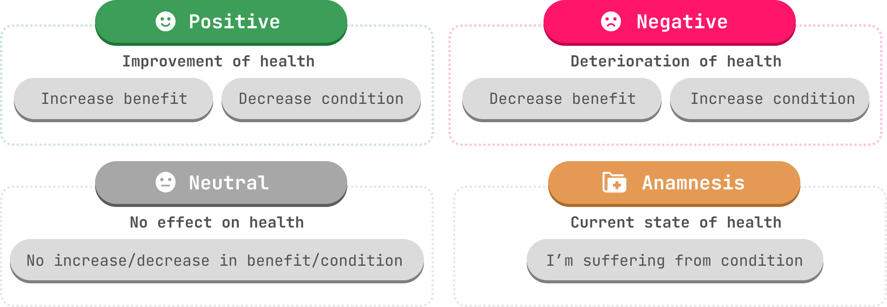

# Welcome to Healthsea ✨
Create better access to health with machine learning and natural language processing. This is the spaCy project for analyzing user reviews to complementary medicine and extract their potential effects on health.


## 💉 Creating better access to health
The goal of Healthsea is to analyze user-written reviews of supplements in relation to their effect on health. Based on this analysis, we aim to provide product recommendations.
For many people, supplements are a great addition for maintaining health and due to its rising popularity, consumers have an increasing access to a variety of products.

However, it's likely that most of the products are redundant or produced in a "quantity over quality" fashion to maximize profit. This creates a white noise of products that make it hard to find suitable supplements. Additionally, manufacturers are not allowed to claim health benefits for their products, which increases the manual work for customers.
To estimate possible health effects, it's required to read and evaluate product reviews manually. 

**With Healthsea, we aim to automize the analysis and provide information in an easily digestible way.** ✨


## 📖 Documentation

| Documentation              |                                                                |
| -------------------------- | -------------------------------------------------------------- |
| ⚙️ **Pipeline**      | Learn more about the pipeline               |
| ⭐️ **Features**           | Learn more about the features of the pipeline              |
| 🪐 **spaCy project**      | Learn more about the spaCy project               |
| ✨ **Demo**                | Learn more about the streamlit app              |

## ⚙️ Pipeline
The Healthsea pipeline uses Named Entity Recognition to detect two types of entities ```Condition``` and ```Benefit```. ```Conditions``` can be defined as health aspects that can be improved by decreasing them, they are generally diseases, symptoms or vague descriptions of health problems (pain in back). ```Benefits``` on the other hand, are desired states of health (muscle recovery, glowing skin) and are improved by increasing them.


After the NER we use Text Classification to predict how the health aspects are affected by the product. As preprocessing we use Clause Segmentation based on the [benepar parser]() to split sentences and blind entities to improve generalization. These processed clauses are then fed into our modified Text Classifier, Clausecat, which predicts four different exclusive classes: ```Positive, Negative, Neutral, Anamnesis```.



> You can read more about the pipeline in the [blog post](explosion.ai)

## ⭐️ Features
This project includes following features:
- Training a [Named Entity Recognition model](https://spacy.io/usage/linguistic-features#named-entities) 
- Building [custom spaCy components](https://spacy.io/usage/processing-pipelines#custom-components) and utilizing pipelines from the [spaCy universe](https://spacy.io/universe)
- Bulding and training a custom Text Classificaton model (Clausecat)

## 🪐 spaCy project
The ```project``` folder contains a [spaCy project](https://spacy.io/usage/projects) that holds all the data and training workflows.

Use ```spacy project run``` inside the project folder to get an overview of all commands and assets. For more detailed documentation, visit the [project folders readme](https://github.com/thomashacker/healthsea/tree/main/project). 

## ✨ Demo
The ```demo``` folder contains a [streamlit app](https://streamlit.io/) which visualizes the analyzed dataset and shows the pipeline in production. The app shows product/substance recommendations for specific health conditions.

For more detailed documentation, visit the [demo folders readme](https://github.com/thomashacker/healthsea/tree/main/demo).


